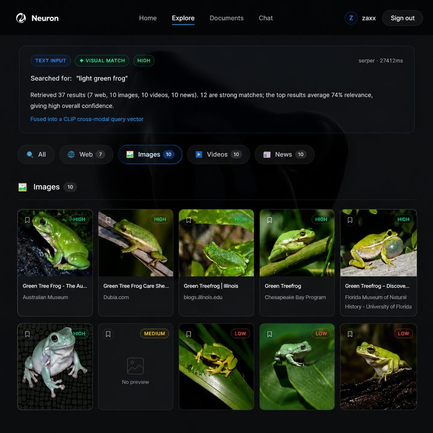
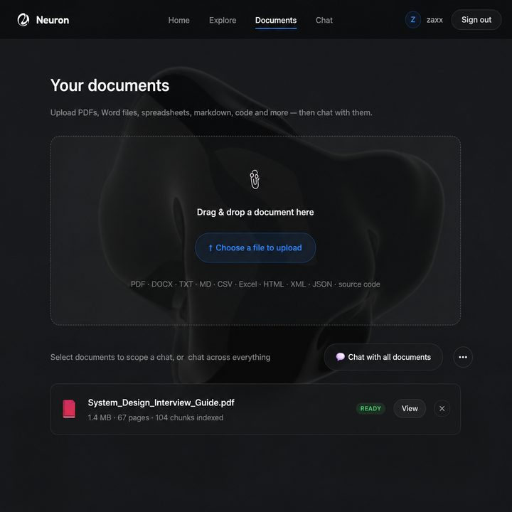
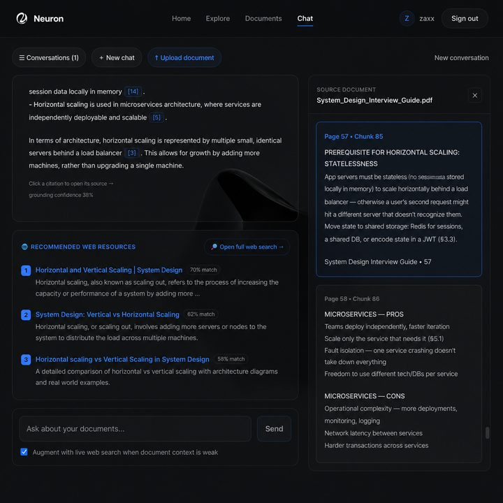

<div align="center">

<picture>
  <source media="(prefers-color-scheme: dark)" srcset="docs/media/logo-lockup-dark.png">
  
</picture>

### Search beyond words.

One interface for text, images, audio and video — fused into a single query,
ranked by what things *mean* and what they *look like*, with every result
explaining why it ranked where it did.

<sub>FastAPI · React 19 · CLIP · Whisper · BLIP · FAISS · MongoDB</sub>

</div>

---

## What it does

**Multimodal search.** Search the live web with text and/or any combination of
files — `image + query`, `audio + image + query`. Every input is fused into
**one CLIP query vector** (the picture's actual pixels, not a caption of them)
plus a keyword query. Image and video results are then re-ranked by real visual
similarity, blended with dense-embedding, BM25 and provider-position signals.
**Every result carries a relevance analysis**: score, confidence, contributing
signals and a plain-language explanation.

**Document chat.** Upload PDFs, DOCX, TXT, Markdown, CSV, Excel, HTML, XML,
JSON or source code and converse with them. Answers are grounded in retrieved
context with numbered citations that navigate back to the exact page, section
and line range. Weak context can be augmented with live web search.

| | |
|---|---|
|  |  |
| **Multimodal search** — one bar for every input type | **Visual match** — ranked by pixel similarity, not filename |
|  |  |
| **Documents** — upload, index, browse chunk locations | **Document chat** — grounded answers with clickable citations |

## Architecture

A layered FastAPI backend; dependencies point strictly inward
(API → services → core/ml/db).

```
backend/app/
├── main.py         # App factory: middleware, routers, lifespan
├── core/           # config · logging · exceptions · security · middleware
│                   # net (SSRF guard) · throttle · sanitize
├── api/v1/         # Versioned routes: auth, search, documents, chat, system
├── schemas/        # Pydantic API contracts
├── services/
│   ├── search/     # understanding → retrieval → ranking → transparency
│   ├── providers/  # SearchProvider interface + Serper
│   ├── vector/     # VectorStore interface + persistent FAISS
│   ├── ingestion/  # Safe upload handling + modality processing
│   ├── rag/        # parsers → chunking → indexer → retriever → chat
│   └── auth/       # Registration, login, token refresh
├── ml/             # Lazy model registry + inference facade
└── db/             # MongoDB client, repositories, domain models
```

The visual system is documented separately in [design.md](design.md).

**Design decisions that matter**

- **Lazy ML loading** — the API starts instantly, models load on first use, and a missing optional dependency disables one capability instead of crashing the platform (`GET /api/v1/system/capabilities` reports live status).
- **Graceful degradation everywhere** — no embedder? Ranking falls back to BM25 and the response is flagged `degraded`. No generator? Chat returns cited extractive answers.
- **Pluggable generation** — Groq hosted models (sub-second) when `GROQ_API_KEY` is set → small local model → extractive fallback.
- **Transparency as a contract** — the response schema *requires* per-result signals, confidence and explanations. Unexplained ranked lists are structurally impossible.
- **Location-aware RAG** — parsers preserve pages, headings and line ranges; chunking keeps them; citations expose them. Clicking a citation opens the source scrolled to the exact chunk.
- **Interfaces over implementations** — `VectorStore` and `SearchProvider` are abstract; FAISS and Serper are swappable details.

## Quick start

**Prerequisites:** Python 3.11+, Node 18+, MongoDB (local or Atlas), and
[FFmpeg](https://www.gyan.dev/ffmpeg/builds/) on `PATH` for audio transcription.

```bash
cd backend && python -m venv .venv && .venv\Scripts\activate
pip install -r requirements.txt
copy .env.example .env          # then set SECRET_KEY, MONGODB_URI, SERPER_API_KEY
cd .. && npm run install:all
```

Then, from the repository root:

```bash
npm run dev
```

Backend on `http://127.0.0.1:8000` (docs at `/docs`), frontend on
`http://localhost:5173`, colour-coded logs, `Ctrl+C` stops both. Collections and
indexes are created on first startup — no migrations. Run either side alone with
`npm run dev:backend` / `npm run dev:frontend`.

Leave `VITE_API_BASE_URL` **blank** in development: the Vite dev server proxies
`/api` to the backend so the browser sees one origin and auth cookies stay
first-party.

## API (v1)

| Area | Endpoint | Purpose |
|---|---|---|
| System | `GET /system/health` · `/system/capabilities` | Liveness · live model & provider status |
| Auth | `POST /auth/register` · `login` · `refresh` · `logout` | Cookie-delivered JWT access + refresh |
| | `GET` · `PATCH /auth/me` · `POST /auth/change-password` | Profile and credentials |
| Profile | `GET/DELETE /profile/history` · `GET/POST/DELETE /profile/saved` | Search history · saved results |
| Search | `POST /search` | Multimodal search (text and/or multiple files) |
| | `POST /search/transcribe` | Speech-to-text for the voice button |
| Documents | `POST` · `GET` · `DELETE /documents` · `/{id}/chunks` | Upload, index, inspect, remove |
| | `POST /documents/query` | Semantic search within your documents |
| Chat | `POST /chat/sessions` · `/{id}/ask` | Grounded Q&A with citations |

All paths are prefixed `/api/v1`. Every error shares one envelope:

```json
{ "error": { "code": "not_found", "message": "Document not found", "request_id": "ab12cd34ef56" } }
```

## Security

- **Cookie + JWT auth** — short-lived access and refresh JWTs with typed claims, delivered as **httpOnly cookies** that page JavaScript cannot read. The client refreshes transparently on expiry.
- **PBKDF2-SHA256** password hashing, 210k iterations, per-password salt, constant-time comparison.
- **Login throttling** — failed sign-ins are counted per (IP + email) and locked out for a cooldown; a success clears the count.
- **CSRF** — state-changing requests carrying a foreign `Origin` are rejected, which covers the multipart endpoints that CORS preflight alone does not.
- **SSRF guard** — every outbound thumbnail fetch must resolve to a public unicast address, and redirects are followed manually so each hop is re-validated.
- **Upload hardening** — extension allow-lists, magic-byte validation (including EBML and ISO-BMFF containers), sanitised filenames, content-hash storage, size caps.
- **Per-user ownership** enforced on every document and chat query.
- Sliding-window rate limiting (proxy-aware via `TRUSTED_PROXY_HOPS`), body-size limits, full security-header set, strict CORS allow-list.
- Production startup **refuses to boot** on an unset `SECRET_KEY`, insecure cookie settings, or a wildcard CORS origin.

## Deployment

The frontend is a static Vite bundle and deploys anywhere — Vercel, Netlify,
Cloudflare Pages. **The backend cannot go on Vercel**: it needs torch, Whisper,
CLIP and FFmpeg, holds models in process memory, and keeps an in-process FAISS
index — far past a serverless function's limits. Host it on a persistent
container (Render, Railway, Fly.io, or a VM) and point the frontend at it.

For a split deployment, set in the backend environment:

```env
ENVIRONMENT=production
COOKIE_SECURE=true
COOKIE_SAMESITE=none              # required for a separate frontend domain
CORS_ORIGINS=https://your-app.vercel.app
TRUSTED_PROXY_HOPS=1              # if behind a proxy or CDN
```

and `VITE_API_BASE_URL=https://your-api-host` in the frontend. Run a **single
worker**, or move rate limiting and login throttling to a shared store — both
are in-process and their limits otherwise multiply by the worker count. An SPA
host also needs a rewrite of all paths to `/index.html`, or deep links 404.

## Configuration

Everything is environment-driven — see [`backend/.env.example`](backend/.env.example).

| Variable | Default | Purpose |
|---|---|---|
| `SECRET_KEY` | — | JWT signing key. **Required** in production |
| `MONGODB_URI` | `mongodb://localhost:27017` | Database connection |
| `SERPER_API_KEY` | — | Live web search ([serper.dev](https://serper.dev)) |
| `GROQ_API_KEY` | — | Fast hosted generation; falls back to a local model |
| `CORS_ORIGINS` | localhost:5173 | Exact frontend origins. Never `*` |
| `COOKIE_SECURE` / `COOKIE_SAMESITE` | `false` / `lax` | `true` / `none` for a split deployment |
| `TRUSTED_PROXY_HOPS` | `0` | Proxies in front of the app, for correct client IPs |
| `LOGIN_MAX_FAILURES` | `8` | Failed sign-ins before lockout |
| `RATE_LIMIT_REQUESTS` | `120` | Requests per window per client |
| `MAX_UPLOAD_SIZE_MB` | `25` | Upload ceiling |
| `WHISPER_MODEL` / `CLIP_MODEL` | `base` / `ViT-B/32` | Model selection |
| `ENABLE_LOCAL_LLM`, `ENABLE_QUERY_EXPANSION` | `true` | Feature flags |

Heavy ML packages are optional at runtime: without them the platform still
serves search with BM25 ranking and extractive document chat.

## Extending

| To add… | Touch only… |
|---|---|
| A search provider (Bing, Brave, …) | `services/providers/` — implement `SearchProvider` |
| A document format | `services/rag/parsers.py` — one parser + dispatch entry |
| A ranking signal | `services/search/ranking.py` + its transparency description |
| A vector database | `services/vector/` — implement `VectorStore` |
| A persisted entity | `db/repositories.py` — add a repository method |
| An ML model | `ml/loaders.py` — one loader + registration |
| API v2 | `api/v2/` — mount beside v1, no breaking changes |

## Repository layout

```
backend/     FastAPI application, ML pipeline, MongoDB repositories
frontend/    React 19 + Vite SPA
docs/media/  Brand assets used by this README
_archive/    Unused files kept out of the build (gitignored, not deleted)
design.md    Visual system: tokens, motion, component chrome
```
